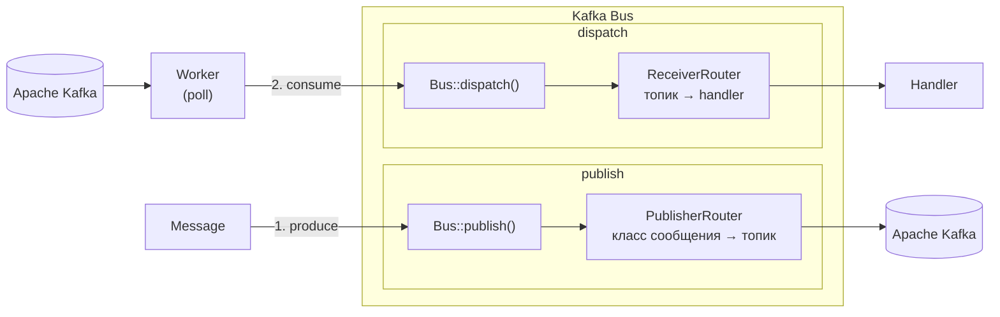

# kafka-bus-core

[](https://github.com/kafka-bus/kafka-bus/actions?query=workflow%3Arun-tests+branch%3A1.x)
[](https://github.com/kafka-bus/kafka-bus/actions?query=workflow%3Acode-style+branch%3A1.x)
[](https://github.com/kafka-bus/kafka-bus/actions?query=workflow%3Aphpstan+branch%3A1.x)

Монорепозиторий core-пакетов экосистемы [kafka-bus](https://github.com/kafka-bus/kafka-bus).

## Пакеты

| Пакет                | Директория          | Packagist                                                                                                                                           |
|----------------------|---------------------|-----------------------------------------------------------------------------------------------------------------------------------------------------|
| `kafka-bus/core`     | `packages/core`     | [](https://packagist.org/packages/kafka-bus/core)         |
| `kafka-bus/commiter` | `packages/commiter` | [](https://packagist.org/packages/kafka-bus/commiter) |
| `kafka-bus/messages` | `packages/messages` | [](https://packagist.org/packages/kafka-bus/messages) |
| `kafka-bus/worker`   | `packages/worker`   | [](https://packagist.org/packages/kafka-bus/worker)     |
| `kafka-bus/metadata` | `packages/metadata` | [](https://packagist.org/packages/kafka-bus/metadata) |

> Laravel- и Spiral-интеграции живут в отдельных репозиториях — у них свой цикл версионирования.

---

## Архитектура

`Bus` — единая точка входа: и публикация, и приём сообщений проходят через него, у каждого направления свой роутер. Чтение из Kafka — не задача `Bus`: `Worker` только поллит топики и передаёт сырые сообщения в `Bus::dispatch()`.



Это два независимых процесса (обычно — разные процессы ОС), но оба проходят через один и тот же `Bus`. Apache Kafka на схеме показан дважды только для читаемости — это один и тот же кластер.

---

## Локальная разработка

```bash
# Установить все зависимости (корневой пакет подключает packages/*/src автозагрузкой)
composer install

# Запуск тестов
composer test

# PHPStan
composer analyse

# Code style
composer format
```

## Changelog

Please see [CHANGELOG](CHANGELOG.md) for more information on what has changed recently.

## Credits

- [Kirill Popkov](https://github.com/popkovkirill)
- [All Contributors](../../contributors)

## License

The MIT License (MIT). Please see [License File](LICENSE.md) for more information.